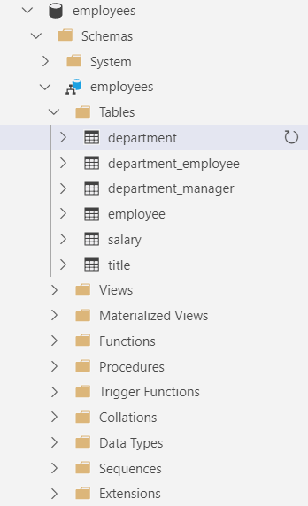

Steps to set up Azure Database, client tools and load data

## Step 1: Set up Azure Database for PostgreSQL
Example setup see this [tutorial](https://microsoftlearning.github.io/mslearn-postgresql/Instructions/Labs/01-exercise-explore-azure-database-postgresql.html)

## Step 2: Install Azure Data Studio and connect to the Azure database as in step 1
This is used to better visualize data query results

Example set up see this [tutorial](https://microsoftlearning.github.io/mslearn-postgresql/Instructions/Labs/02-exercise-explore-client-tools.html#install-azure-data-studio)

## Step 3: Install `psql`
This is prepared to run `pg_restore` in step 5

Example set up see this [tutorial](https://microsoftlearning.github.io/mslearn-postgresql/Instructions/Labs/02-exercise-explore-client-tools.html#client-tools-to-connect-to-postgresql)

## Step 4: Create the database and schema

### If using `psql`:
Connect to the server:
```
psql --h <servername> --p <port> -U <username> <dbname>
``` 
Create the database and schema:
```
CREATE DATABASE employees;
\c employees
CREATE SCHEMA employees;
```

### If using Azure Data Studio:
Create database first:
```
CREATE DATABASE employees;
```
Then configure the connection to specify database `employees`

Then create schema:
```
CREATE SCHEMA employees;
```

## Step 5: Load sample data

The sample data come from the "employee" dataset from [this Github repo](https://github.com/neondatabase-labs/postgres-sample-dbs?tab=readme-ov-file#employees-database).


```
cd data
```
```
pg_restore -d postgres://<user>:<password>@<hostname>/employees -c -v --no-owner --no-privileges employees.sql.gz
```

Then if you go to the Azure Data Studio, should be able to see the data loaded:

